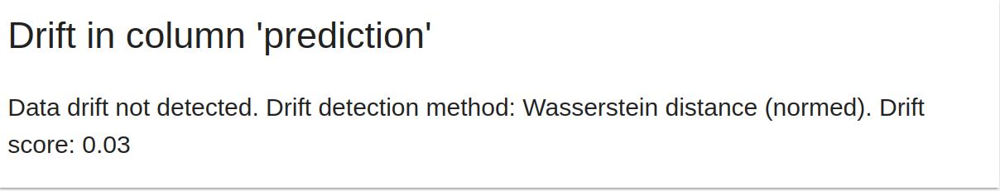

# Baseline model for batch monitoring example

In this example, [Newyork city taxi dataset](https://www.nyc.gov/site/tlc/about/tlc-trip-record-data.page) is used. Green taxi dataset of Janurary 2021 will be used as training and validation datasets.

## Step-1: Model Creation using training and validation data and Evaluation

The following steps needed to be run in order.

- Import the necessary libraries like pandas, datetime etc.

```python
import requests
import datetime
import pandas as pd

from joblib import load, dump
from tqdm import tqdm

from sklearn.linear_model import LinearRegression
from sklearn.metrics import mean_absolute_error, mean_absolute_percentage_error
```

- Download the dataset using **requests** library.

```python
files = [('green_tripdata_2022-02.parquet', './data'), ('green_tripdata_2022-01.parquet', './data')]

print("Download files:")
for file, path in files:
    url=f"https://d37ci6vzurychx.cloudfront.net/trip-data/{file}"
    resp=requests.get(url, stream=True)
    save_path=f"{path}/{file}"
    with open(save_path, "wb") as handle:
        for data in tqdm(resp.iter_content(),
                        desc=f"{file}",
                        postfix=f"save to {save_path}",
                        total=int(resp.headers["Content-Length"])):
            handle.write(data)
```

- Importing janauray dataset, create the target variable named **duration_min** and  remove outlier from the data.

```python
jan_data = pd.read_parquet('data/green_tripdata_2022-01.parquet')

# create target
jan_data["duration_min"] = jan_data.lpep_dropoff_datetime - jan_data.lpep_pickup_datetime
jan_data.duration_min = jan_data.duration_min.apply(lambda td : float(td.total_seconds())/60)

# filter out outliers
jan_data = jan_data[(jan_data.duration_min >= 0) & (jan_data.duration_min <= 60)]
jan_data = jan_data[(jan_data.passenger_count > 0) & (jan_data.passenger_count <= 8)]
```

- Set the target features, numerical features and categorical features.

```python
target = "duration_min"
num_features = ["passenger_count", "trip_distance", "fare_amount", "total_amount"]
cat_features = ["PULocationID", "DOLocationID"]
```

- Train test split and model training 

```python
## train test split
train_data = jan_data[:30000]
val_data = jan_data[30000:]

## model training
model = LinearRegression()

model.fit(train_data[num_features + cat_features], train_data[target])
```

- Predict and evaluate the training and validation data

```python
## Model Prediction
train_preds = model.predict(train_data[num_features + cat_features])
train_data['prediction'] = train_preds

val_preds = model.predict(val_data[num_features + cat_features])
val_data['prediction'] = val_preds

## Model Evaluation
print(mean_absolute_error(train_data.duration_min, train_data.prediction))
print(mean_absolute_error(val_data.duration_min, val_data.prediction))
```

## Step-2: Saving model and  the reference data

The model and the validation dataset will be used.

```python
with open('models/lin_reg.bin', 'wb') as f_out:
    dump(model, f_out)

val_data.to_parquet('data/reference.parquet')
```

## Step-3: Creating Evidently Report

- Import the necessary classes from evidently library.
```python
from evidently import ColumnMapping
from evidently.report import Report
from evidently.metrics import ColumnDriftMetric, DatasetDriftMetric, DatasetMissingValuesMetric
```

- Create **column_mapping** object. We need to properly set which columns are **numerical**, which columns are **categorical** and which is the **predicted value** columns from pandas dataframe. (Because regarding the data type by pandas can go wrong sometimes).

```python
column_mapping = ColumnMapping(
    target=None,
    prediction='prediction',
    numerical_features=num_features,
    categorical_features=cat_features
)
```

- Then create the report object by defining which metrics we want to include in our monitoring report.

```python
report = Report(metrics=[
    ColumnDriftMetrics(column_name="prediction"),
    DatasetDriftMetric(),
    DatasetMissingValuesMetric()
])
```

- After than, we need to create the report by using **report.run()** by giving **reference_data**, **current_data** and **column_mapping**  which we defined in above step.

```python
report.run(reference_data=train_data, current_data=val_data, column_mapping=column_mapping)
```

- Now, we can see the report by using **report.show(mode='inline')** in jupyter notebook.
```python
report.show(mode='inline')
```

This is how we see monitoring report in jupyter notebook.



<br>

 <br>

<br>

- We can also create the json data from the report to check the quantitive measures of the respective drift.

```python
## create a dictionary data from the report
result = report.as_dict()

## prediction drift score - first metric
print(result['metrics'][0]['result']['drift_score'])

## number of drifted columns  - second metric
print(result['metrics'][1]['result']['number_of_drifted_columns'])

## number of missing values - third metric
print(result['metrics'][2]['result']['current']['share_of_missing_values'])
```


