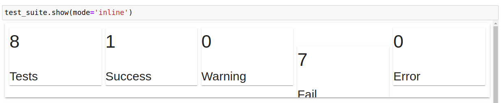
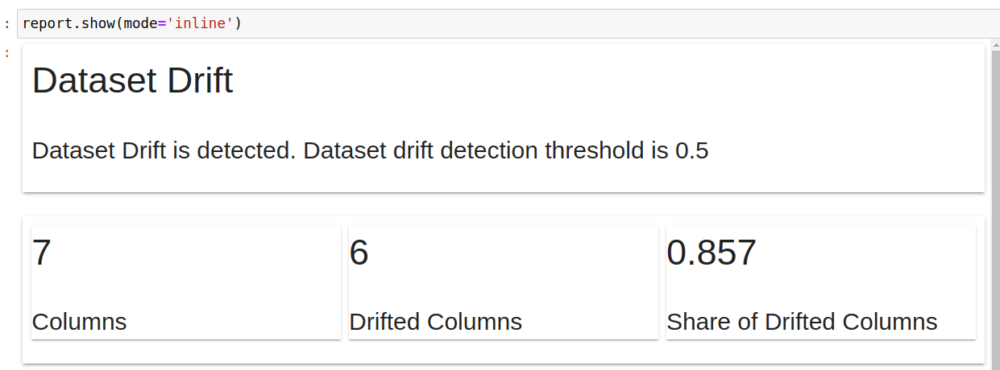

# Debugging model and data 

We can debug our data and models by using **Test Suites** and Reports from Evidently. Evidently helps evaluate, test and monitor ML models in production.

## Core concept

Before going to the code, let me explain the core concept of Evidently.

- A **Metric** is a core component of Evidently. You can combine multiple **Metrics** in a **Report**. Reports are best for visual analysis and debugging of your models and data.

- A **Test** is a metric with a condition. Each test returns a pass or fail result. You can combine multiple **Tests** in a **Test Suite**. Test Suites are best for automated model checks as part of an ML pipeline.

- For both Tests and Metrics, Evidently has **Presets**. These are pre-built combinations of metrics or checks that fit a specific use case.

We can read more at [here!](https://docs.evidentlyai.com/readme/core-concepts)

## Implementation

### Step-1 Importing the necessary libraries

```python
import datetime
import pandas as pd

from evidently import ColumnMapping
from evidently.report import Report

## metric
from evidently.metric_preset import DataDriftPreset

## test
from evidently.test_suite import TestSuite
from evidently.test_preset import DataDriftTestPreset

from joblib import dump, load

from sklearn.linear_model import LinearRegression
from sklearn.metrics import mean_absolute_error, mean_absolute_percentage_error
```

### Step-2 Load data and model

```python
## loading the reference data from Jan 2022
ref_data = pd.read_parquet('data/reference.parquet')

## current data as Feb 2022
current_data = pd.read_parquet('data/green_tripdata_2022-02.parquet')

## loading the model
with open('models/lin_reg.bin', 'rb') as f_in:
    model = load(f_in)

## data labeling
target = "duration_min"
num_features = ["passenger_count", "trip_distance", "fare_amount", "total_amount"]
cat_features = ["PULocationID", "DOLocationID"]

## problematic_data as Feb 2 data 
problematic_data = current_data.loc[(current_data.lpep_pickup_datetime >= datetime.datetime(2022,2,2,0,0)) & 
                               (current_data.lpep_pickup_datetime < datetime.datetime(2022,2,3,0,0))]
```

### Step-3 Generate Test Suites and Report


```python
## setting up

column_mapping = ColumnMapping(
    prediction='prediction',
    numerical_features=num_features,
    categorical_features=cat_features,
    target=None
)

problematic_data['prediction'] = model.predict(problematic_data[num_features + cat_features].fillna(0))
```


Generating **TestSuite**

```python
test_suite = TestSuite(tests = [DataDriftTestPreset()])
test_suite.run(reference_data=ref_data, current_data=problematic_data, column_mapping=column_mapping)
```

Checking **TestSuite** in **inline** mode

```python
test_suite.show(mode='inline')
```



Generating **Report**

```python
report = Report(metrics = [DataDriftPreset()])
report.run(reference_data=ref_data, current_data=problematic_data, column_mapping=column_mapping)
```

Checking **Report** in **inline** mode
```
report.show(mode='inline')
```

