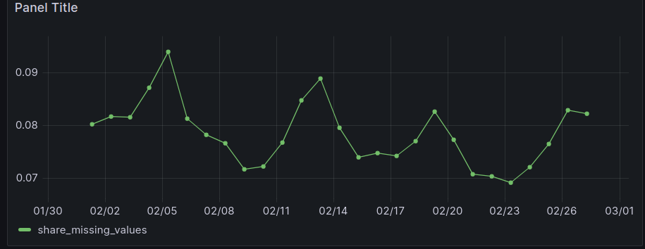
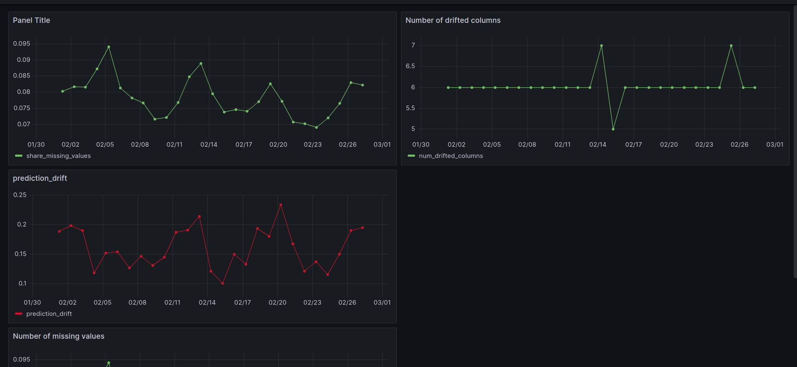
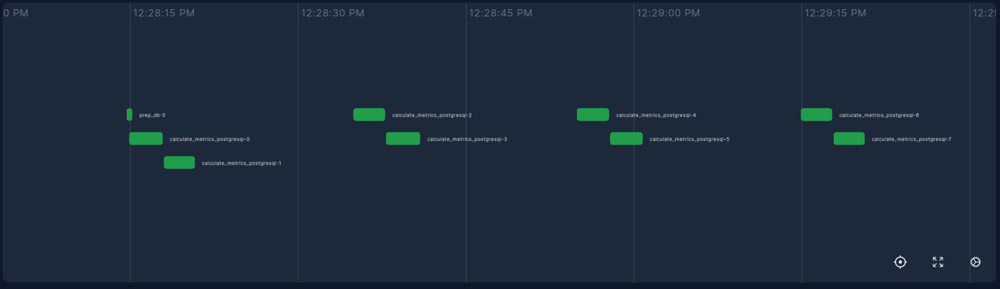

# Evidently Metrics Calculation

This is how to make a script that can monitor **batch ML monitoring** by using Prefect, PostgresSQL, Adminer, Grafana and Evidently. The primary objective of this script is to identify and log any changes in the model's prediction, which is known as **drift detection**.

So, what is **data drift**? If the input data’s distribution (age, income, and location) for the new data fed to the model differs significantly from the distribution of the input data in the training dataset, this could lead to data drift and result in the model becoming less accurate.

- Prefect is for workflow orchestration.
- PostgresSQL is for storing the prediction log 
- Adminer is for managing the database.
- Grafana is for visualization the metrics with dashboard.
- Evidently can provide the metrics to be used in drift detection.

The following python codes can be used to create drift metrics calculation

## Step-0: Prerequisite

First, we need to install all the [related libraries](./Requirements.md) and run the **[docker compose](./Docker-compose.md)** file. Run the docker compose file in order to run the services of **PostgresSQL**, **Adminer** and **Grafana**. Run the following command:

```bash
docker compose up
```

If you run for the first time, use 

```bash
docker compose up --build
```

Start the prefect server with the following command:
```bash
prefect server start
```

We could specify the grafana datasource configureation in **config** folder by using the file named **grafana_datasources.yaml**. Check how to create it in [here](./Grafana_data_source.md)

## Step-1: Importing the library

```python
import datetime
import time
import random
import logging 
import pandas as pd
import psycopg
import joblib

from prefect import task, flow

from evidently.report import Report
from evidently import ColumnMapping
from evidently.metrics import ColumnDriftMetric, DatasetDriftMetric, DatasetMissingValuesMetric
```

## Step-2: Declaring global variables

```python
logging.basicConfig(level=logging.INFO, format="%(asctime)s [%(levelname)s]: %(message)s")

## timeout for simulation
SEND_TIMEOUT = 10
rand = random.Random()

## creat db
create_table_statement = """
drop table if exists dummy_metrics;
create table dummy_metrics(
	timestamp timestamp,
	prediction_drift float,
	num_drifted_columns integer,
	share_missing_values float
)
"""

## reading reference data and loading the linear regression model
reference_data = pd.read_parquet('data/reference.parquet')
with open('models/lin_reg.bin', 'rb') as f_in:
	model = joblib.load(f_in)

## reading current dataset
raw_data = pd.read_parquet('data/green_tripdata_2022-02.parquet')

## setting features
begin = datetime.datetime(2022, 2, 1, 0, 0)
num_features = ['passenger_count', 'trip_distance', 'fare_amount', 'total_amount']
cat_features = ['PULocationID', 'DOLocationID']

## mapping features 
column_mapping = ColumnMapping(
    prediction='prediction',
    numerical_features=num_features,
    categorical_features=cat_features,
    target=None
)

## creating report
## will monitor the prediction drift, dataset drift and dataset missing values
report = Report(metrics = [
    ColumnDriftMetric(column_name='prediction'),
    DatasetDriftMetric(),
    DatasetMissingValuesMetric()
])

```

## Step-3: Prepare the database

```python
@task
def prep_db():
	with psycopg.connect("host=localhost port=5432 user=postgres password=example", autocommit=True) as conn:
		res = conn.execute("SELECT 1 FROM pg_database WHERE datname='test'")
		if len(res.fetchall()) == 0: ## db didn't exist
			conn.execute("create database test;")
		with psycopg.connect("host=localhost port=5432 dbname=test user=postgres password=example") as conn: ## db connect
			conn.execute(create_table_statement)

```

## Step-4: Calculate the metrics 

The following code can calculate the **drift metrics** related with **current data** and store the **result** into the database.

```python
@task
def calculate_metrics_postgresql(curr, i):
	current_data = raw_data[(raw_data.lpep_pickup_datetime >= (begin + datetime.timedelta(i))) &
		(raw_data.lpep_pickup_datetime < (begin + datetime.timedelta(i + 1)))]

	#current_data.fillna(0, inplace=True)
	current_data['prediction'] = model.predict(current_data[num_features + cat_features].fillna(0))

    ## create the report
	report.run(reference_data = reference_data, current_data = current_data,
		column_mapping=column_mapping)

    ## change to dictionary format
	result = report.as_dict()

    ## calculate drift metrics
	prediction_drift = result['metrics'][0]['result']['drift_score']
	num_drifted_columns = result['metrics'][1]['result']['number_of_drifted_columns']
	share_missing_values = result['metrics'][2]['result']['current']['share_of_missing_values']

    ## insert into database
	curr.execute(
		"insert into dummy_metrics(timestamp, prediction_drift, num_drifted_columns, share_missing_values) values (%s, %s, %s, %s)",
		(begin + datetime.timedelta(i), prediction_drift, num_drifted_columns, share_missing_values)
	)
```

## Step-4: Batch monitoring backfill

```python
@flow
def batch_monitoring_backfill():
	prep_db()  
	last_send = datetime.datetime.now() - datetime.timedelta(seconds=10)
	with psycopg.connect("host=localhost port=5432 dbname=test user=postgres password=example", autocommit=True) as conn:
		for i in range(0, 27):
			with conn.cursor() as curr:
				calculate_metrics_postgresql(curr, i)

            ## below code is used for time simulation
            ## wait till 10 seconds
			new_send = datetime.datetime.now()
			seconds_elapsed = (new_send - last_send).total_seconds()
			if seconds_elapsed < SEND_TIMEOUT:
				time.sleep(SEND_TIMEOUT - seconds_elapsed)
			while last_send < new_send:
				last_send = last_send + datetime.timedelta(seconds=10)
			logging.info("data sent")

```

## Step-5: Run **batch_monitoring_backfill function**

```
if __name__ == '__main__':
	batch_monitoring_backfill()
```


## Results

- Prediction logs can be seen at **Adminer**. (http://localhost:8080/)

<br>

- Drift metrics can be visualized at **Grafana** dashboard. (http://localhost:3000/)

<br>

<br>

<br>

- Prefect flow can be visualized at (http://localhost:4200/)

<br>

[Prev](./Baseline_monitoring_example.md) | [Next](./Saving_grafana_dashboards.md)