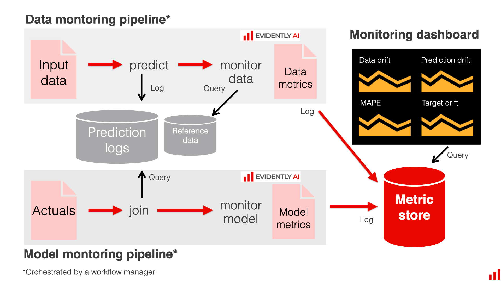

# Model Monitoring using evidently.ai

For machine learning models, we need to monitor not only **service health** (eg. resource usage like CPU or RAM usage) but also **model health**.

Model health means

- Model Performance(**rmse**, **accuracy score**)
- Data Quality and integritity (Since the error-based metrics like **rmse** need the ground-truth label to calculate, we need to check other metrics like **data quality** and **data integrity** that don't need ground-truth label to calculate.)
- **Data** and **Concept Drift**, the metrics that calculate the input distribution and model output in reference dataset

We can also monitor the other things like

- Model Bias / fairness
- Outliers
- Model Explainability 

## How to monitor data quality??

### Monitoring Data Quality in batch Deployment

- Some metrics can only be monitored in batch mode deployment.
- We need two datasets, **current dataset** which is the data we want to **score**(aka. predict) in batch mode and **reference dataset** which is the data (**training** set or **validation** set)  used to train the models. Then we will compare these two datasets to create the **metrics**. We can monitor the metrics like

    - Data Distribution (eg. normality)
    - Discriptive statistics: **average**, **median**, **quantile**, **min-max** for individual features
    - statistical tests to get **confidence level**

### Monitoring Data Quality in non-batch Deployment

- Non-batch deployment means deploying the model in **REST api** as web service.
- But in non-batch deployment, we can't calculate the **data drift** in a single prediction. We can only calculate these metrics when we get some amount of the data.
- In this kind of scenario, we need to pick a window function (eg. moving window with or without moving reference) and compare these windows.

 

 

## Baseline model for batch monitoring example

- In order to run batch monitoring, we will need to run three services by using **docker compose**.

1. postgres database to store the logs
2. adminer which is a database management tools
3. grafana dashboard to visualize the metrics.

